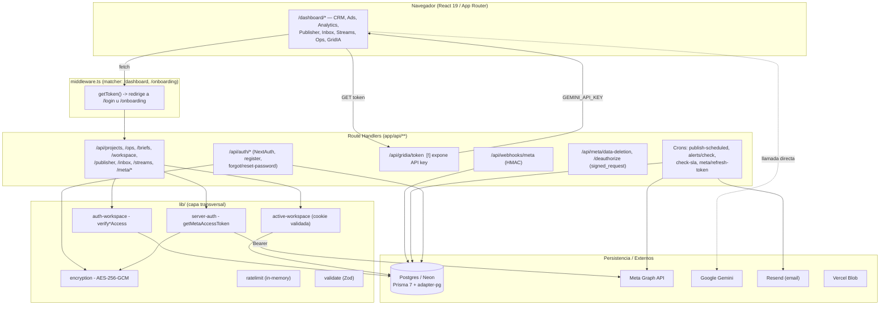

# Auditoría Técnica y de Seguridad — Sodare (v2)

> Revisión estática nivel staff (arquitectura, AppSec, rendimiento, infraestructura).
> Fecha: 2026-06-08 · Alcance: working tree actual de `sodare`.
> **Supera a `AUDITORIA-SODARE.md`** (auditoría previa sobre la rama `feat/onboarding-anti-duplicate-workspaces`).

---

## Actualización vs. auditoría previa

Varias alertas del informe anterior **ya están remediadas** en el código actual y se dan por cerradas:

| Hallazgo previo | Estado hoy | Evidencia |
|---|---|---|
| H1 `prisma db push` en build | ✅ Corregido | `build` ahora es `prisma generate && next build`; el `db-sync` se movió a `release`. |
| H2 Validación ausente (zod 3/86) | ✅ Muy mejorado | Existe `lib/validate.ts`; `register`/`forgot`/`reset`/roles usan `validateBody` + Zod. |
| H3 Sin rate limiting en auth | ✅ Corregido | `lib/ratelimit.ts` aplicado en `register`, `forgot-password`, `reset-password`. |
| H5 Falta CSP | ✅ Corregido | `next.config.ts → headers()` ahora emite CSP + `frame-ancestors 'none'`. |
| H7 (AI-Ops) "verificar que la key de Gemini no llegue al cliente" | ❌ **Confirmado como vulnerabilidad** | Ver Hallazgo #1: la key **sí** llega al cliente. |

Esta pasada se centra en lo que **queda abierto** y en defectos más profundos no detectados antes.

---

## Resumen Ejecutivo

**Propósito.** Sodare es un SaaS **multi‑tenant para agencias de marketing**: CRM/proyectos, Ads Manager (Meta), Analytics orgánico, Publisher (programación FB/IG), Inbox 2.0 (Messenger/IG/WhatsApp), Social Listening, Streams, Ops/Tareas con SLA por áreas y generación de parrillas con IA (Gemini "GridIA"). UI en español.

**Stack.** Next.js 16.2.6 (App Router/RSC) · React 19.2 · Tailwind 4 · Zustand · Prisma 7 con `@prisma/adapter-pg` sobre Postgres/Neon · NextAuth v4 (JWT: Credentials+bcrypt, Facebook, Google) · Meta Graph API · Google Gemini · Resend · Vercel Blob/Cron/Speed Insights · Zod · Vitest.

**Patrón.** Monolito modular sobre App Router; multi‑tenancy por `Workspace`; lógica de negocio en los *route handlers* con capa transversal `lib/`. Autorización **por ruta** (no por middleware en `/api`).

**Valoración.** Madurez de seguridad **por encima del promedio**: AES‑256‑GCM correcto, HMAC de webhooks y `signed_request` *timing‑safe*, autorización multi‑tenant **consistente** en rutas `[id]` (sesión → fetch → `verifyWorkspaceAccess` → rol), Zod, rate‑limit en auth, cabeceras/CSP. Sin secretos hardcodeados ni `eval`/`child_process`/SQL crudo en la app.

**Riesgos principales (prioridad):**
1. **CRÍTICO —** `GET /api/gridia/token` entrega la **API key cruda de Gemini** a cualquier usuario autenticado; `geminiClient.ts` la usa desde el navegador. Robo de credencial / abuso de facturación.
2. **ALTO —** *Account pre‑takeover* en `POST /api/auth/register`: fija contraseña sobre cuentas sin contraseña (OAuth/invitación) sin verificar el email.
3. **ALTO/MEDIO —** El webhook de Meta hace **scan de todos los proyectos de todos los tenants** (+ inserts anidados) **en cada evento** entrante.
4. **MEDIO —** Crons inconsistentes/rotos: `check-sla` (método/headers errados → nunca corre), `alerts/check` (bypass `Bearer undefined` + token usado **sin** `decryptToken`).
5. **MEDIO —** Callback de **borrado de datos de Meta es un stub** (verifica firma pero no borra): brecha de cumplimiento.

> **Nota metodológica.** La carpeta está en **OneDrive con archivos "solo en la nube"**, lo que hace poco fiable la *enumeración* recursiva (Glob/Grep pueden subcontar archivos no hidratados). Los hallazgos se basan en **lecturas directas** de los archivos citados. Conviene re‑ejecutar en local `eslint`, `tsc --noEmit`, `npm audit` y un grep completo para cerrar cobertura ruta‑por‑ruta.

---

## Mapa de Arquitectura



**Multi‑tenancy.** `User → WorkspaceMember(role) → Workspace → {Project, Task, ScheduledPost, Integration, Inbox…}`. El *active workspace* sale de la cookie `sodare_active_workspace` **validada contra membership** (`lib/active-workspace.ts`), con fallback al primero — sin IDOR por cookie.

**Auth.** NextAuth en **JWT** (sin adaptador Prisma cableado). El `User` se *upserta* a mano en el callback `jwt`. Tablas `Account`/`Session` del schema **sin uso**; solo `VerificationToken` se usa (reset de contraseña).

---

## Hallazgos Prioritarios

### 1. [CRÍTICO] Fuga de la API key de Gemini al cliente
- **Ubicación:** `app/api/gridia/token/route.ts`; consumida en `app/dashboard/briefing/geminiClient.ts:136`.
- **Problema:** El endpoint devuelve `process.env.GEMINI_API_KEY` en el JSON a **cualquier sesión autenticada** (incluido un `MEMBER`). El cliente llama a `...generativelanguage.googleapis.com/...:generateContent?key=${apiKey}` **desde el navegador**.
- **Riesgo:** Cualquier usuario lee `/api/gridia/token` y exfiltra la clave → consumo a tu cargo, agotamiento de cuota, posible acceso a otros recursos del proyecto Google. La key viaja al cliente en cada generación (visible en DevTools/proxy). "token" es engañoso: es la API key real de larga vida, sin *scope* ni expiración.
- **Evidencia:** `return NextResponse.json({ token: apiKey });` (línea 18) y el `fetch(...?key=${apiKey})` del cliente.
- **Remediación:** Proxy **server‑side** (el navegador manda `formData` a `/api/gridia`, el servidor llama a Gemini). Borrar `/api/gridia/token`, añadir authz por workspace + rate‑limit, y **rotar `GEMINI_API_KEY`**. (Refactor §A.)

### 2. [ALTO] Apropiación de cuentas sin contraseña vía registro
- **Ubicación:** `app/api/auth/register/route.ts:36-49`.
- **Problema:** Si existe un usuario con `password === null` (OAuth o **invitación**), el endpoint permite **fijarle contraseña** conociendo solo el email, sin verificar propiedad del correo.
- **Riesgo:** *Pre‑account‑takeover*: el atacante reclama `victima@empresa.com` antes que el titular y entra por Credentials heredando su membership/rol.
- **Evidencia:** rama `if (existing) { if (existing.password) {409} else { update password } }`.
- **Remediación:** No fijar contraseña sobre cuentas existentes sin **verificación de email** (token vía Resend) o flujo "set‑password" autenticado. (Refactor §B.)

### 3. [ALTO/MEDIO] El webhook escanea todos los proyectos en cada evento
- **Ubicación:** `app/api/webhooks/meta/route.ts:576-657` (`createAlert`).
- **Problema:** Por **cada** evento (DM, comentario, reacción, status WhatsApp…) ejecuta `prisma.project.findMany({ where:{status:"Activo"}, include:{channels, workspace.members} })` — **todos los proyectos de todos los tenants** — y luego itera creando `ProjectAlert` + N notificaciones por miembro.
- **Riesgo:** Coste O(proyectos×miembros) por evento; satura el pool (máx. 10) y puede exceder los 20 s que Meta exige → reintentos en cascada. **DoS amplificable**: quien genere eventos en cualquier página conectada degrada a toda la plataforma. La firma HMAC es correcta pero no acota el coste.
- **Remediación:** Resolver `Channel`/`Project` por el `pageId`/`igAccountId`/`adAccountId` del `entry` con consulta indexada (o tabla `MetaSource{ externalId→projectId }`). Responder 200 y procesar async; `notification.createMany`. (Refactor §C.)

### 4. [MEDIO] Autenticación de crons inconsistente y dos crons rotos
- **Ubicación:** `vercel.json` + `notifications/check-sla`, `alerts/check`, `cron/publish-scheduled`.
- **Problemas:**
  - **`check-sla` nunca corre por cron:** solo exporta `POST` y espera header `x-cron-secret`, pero Vercel Cron invoca con **`GET` + `Authorization: Bearer <CRON_SECRET>`** → 405 / cae a sesión inexistente → 401.
  - **`alerts/check` *bypassable* si falta el secreto:** `authHeader !== "Bearer " + process.env.CRON_SECRET`; con `CRON_SECRET` ausente, `Authorization: Bearer undefined` pasa. `publish-scheduled` sí cierra ese caso.
  - **`alerts/check` usa el token Meta sin descifrar:** toma `(integration.credentials).accessToken` y lo manda como `Bearer` **sin `decryptToken`** → como se guarda cifrado (`enc:...`), Graph falla siempre y el cron de health‑alerts queda inerte. `publish-scheduled` sí descifra (línea 126).
- **Remediación:** Helper único `verifyCronAuth` (GET + Bearer, *fail‑closed*), normalizar todos a `GET`, y `decryptToken` en `alerts/check`. (Refactor §D.)

### 5. [MEDIO] El callback de borrado de datos de Meta no borra datos
- **Ubicación:** `app/api/meta/data-deletion/route.ts:42-51`.
- **Problema:** Verifica bien el `signed_request` (HMAC) pero la lógica de borrado es un comentario; devuelve `confirmation_code` sin persistir la solicitud ni eliminar tokens/cachés/insights del usuario.
- **Riesgo:** Incumple la *Data Deletion Callback* de Meta y obligaciones de privacidad (GDPR / tu propio aviso). Riesgo de *app review* y legal.
- **Remediación:** Persistir la solicitud (`DataDeletionRequest`), encolar borrado real por `user_id`, exponer estado en `/data-deletion?code=`.

### 6. [MEDIO] `inbox/reply` confía en `pageToken`/`pageId`/`recipientId` del cliente
- **Ubicación:** `app/api/inbox/reply/route.ts:47-87`.
- **Problema:** El body trae `pageToken` (cifrado), `pageId`, `recipientId`; el servidor descifra y envía vía Send API sin verificar **antes** que la página/conversación pertenezca al workspace (la verificación de pertenencia es posterior y opcional).
- **Riesgo:** Un miembro podría enviar con `pageId`/`recipientId` arbitrarios según permita el token; además expone *page tokens* cifrados al cliente para que los devuelva.
- **Remediación:** Resolver `pageToken` en el servidor desde la `Integration` del workspace; validar que `conversationId`/`pageId` son del `workspaceId` activo antes de enviar.

### 7. [MEDIO] Build y CSP permisivos
- **Ubicación:** `next.config.ts`.
- **Problema:** `typescript.ignoreBuildErrors: true` despliega con errores de tipos; CSP usa `script-src 'self' 'unsafe-inline' 'unsafe-eval'`.
- **Remediación:** Quitar `ignoreBuildErrors` (o deuda fechada) y correr `tsc --noEmit` en CI para todas las ramas; migrar CSP a *nonces* y eliminar `unsafe-eval`.

### 8. [BAJO] Mensajes de error internos al cliente
- **Ubicación:** `lib/api-response.ts:39-42` (`apiServerError` devuelve `error.message`) y rutas que retornan `{ error: err?.message }`.
- **Remediación:** Loggear el detalle en servidor; devolver mensaje genérico + `code`.

### 9. [BAJO] Rate‑limit en memoria y login sin throttling
- **Ubicación:** `lib/ratelimit.ts`; `authorize()` en `auth.config.ts` sin límite.
- **Riesgo:** Limitador por instancia, se reinicia en *cold start*; login por Credentials sin límite → fuerza bruta.
- **Remediación:** *Store* compartido (Upstash/Redis) y límite por IP+email en login.

### 10. [BAJO] Misceláneos
- **Enumeración por *timing*** en `authorize()` (sin `bcrypt.compare` *dummy*) — `auth.config.ts:67`.
- **Tokens de reset en claro** en `VerificationToken.token` (mejor *hashear*).
- **Conflicto de *account‑linking*:** `User.email` es `@unique`; un OAuth con email ya existente bajo otro `id` viola el constraint, se captura y *swallowed* → sesión sin fila `User` (FK rotas aguas abajo) — `auth.config.ts:95-108`.
- **`decryptToken` devuelve el cifrado si falla** (enmascara errores) — `lib/encryption.ts:80`.
- **Artefactos Prisma obsoletos** en `app/generated/prisma` (`OpsTask`/`ScheduledPublish`, que no coinciden con `Task`/`ScheduledPost`); `lib/prisma.ts` usa `@prisma/client`, así que es código muerto — borrarlo.
- **`middleware.ts` no cubre `/api`** (solo `/dashboard`,`/onboarding`): la seguridad de API depende 100% de checks por ruta (hoy cobertura alta, pero frágil ante una ruta nueva).

---

## Refactor Propuesto

### A. GridIA como proxy server‑side (elimina la fuga de la key) — *CRÍTICO*

```ts
// app/api/gridia/route.ts — la key NUNCA sale del servidor
import { NextRequest, NextResponse } from "next/server";
import { getToken } from "next-auth/jwt";
import { getActiveWorkspaceId } from "@/lib/active-workspace";
import { rateLimit, getClientIP } from "@/lib/ratelimit";
import { z } from "zod";
import { buildGridPrompt, GRID_SCHEMA } from "@/app/dashboard/briefing/geminiClient"; // exportar prompt+schema, NO la key

const Body = z.object({
  client: z.string().min(1), offer: z.string().min(1),
  month: z.string(), postCount: z.number().int().min(1).max(60),
  focus: z.array(z.string()), formats: z.string(), comments: z.string().optional(),
  brandFiles: z.array(z.object({ mimeType: z.string(), data: z.string() })).max(5).default([]),
});

export async function POST(req: NextRequest) {
  const jwt = await getToken({ req });
  if (!jwt?.sub) return NextResponse.json({ error: "No autorizado" }, { status: 401 });
  if (!(await getActiveWorkspaceId(jwt.sub)))
    return NextResponse.json({ error: "Sin workspace" }, { status: 400 });

  const { ok } = rateLimit(`gridia:${jwt.sub}:${getClientIP(req)}`, 10, 60_000);
  if (!ok) return NextResponse.json({ error: "Demasiadas solicitudes" }, { status: 429 });

  const parsed = Body.safeParse(await req.json().catch(() => null));
  if (!parsed.success) return NextResponse.json({ error: "Datos inválidos" }, { status: 422 });

  const apiKey = process.env.GEMINI_API_KEY;
  if (!apiKey) return NextResponse.json({ error: "IA no configurada" }, { status: 500 });

  const parts: any[] = [{ text: buildGridPrompt(parsed.data) }];
  for (const f of parsed.data.brandFiles) parts.push({ inlineData: { mimeType: f.mimeType, data: f.data } });

  const r = await fetch(
    `https://generativelanguage.googleapis.com/v1beta/models/gemini-2.5-flash:generateContent?key=${apiKey}`,
    { method: "POST", headers: { "Content-Type": "application/json" },
      body: JSON.stringify({ contents: [{ parts }],
        generationConfig: { temperature: 0.7, responseMimeType: "application/json", responseSchema: GRID_SCHEMA } }) }
  );
  if (!r.ok) return NextResponse.json({ error: "Error de IA" }, { status: 502 });
  const text = (await r.json()).candidates?.[0]?.content?.parts?.[0]?.text;
  if (!text) return NextResponse.json({ error: "Respuesta IA inválida" }, { status: 502 });
  return NextResponse.json(JSON.parse(text));
}
```
Cliente: reemplazar la llamada directa a Google por `fetch('/api/gridia', { method:'POST', body: JSON.stringify(formData) })`. **Borrar** `app/api/gridia/token/route.ts` y **rotar** `GEMINI_API_KEY`.

### B. Registro sin apropiación de cuentas — *ALTO*

```ts
// app/api/auth/register/route.ts (rama "existe sin contraseña")
if (existing) {
  if (existing.password) {
    return NextResponse.json({ error: "Este email ya está registrado" }, { status: 409 });
  }
  // Cuenta sin password (OAuth/invitación): NO fijar password aquí.
  await sendSetPasswordVerification(existing.email!); // VerificationToken + email (Resend)
  return NextResponse.json({ success: true, requiresEmailVerification: true }, { status: 202 });
}
```
La contraseña se fija en `reset-password`/`set-password` **tras** validar el token enviado al correo del titular.

### C. Webhook: resolver proyecto por ID del evento (sin scan global) — *ALTO/MEDIO*

```ts
async function findProjectsForSource(meta: { pageId?: string; igAccountId?: string; adAccountId?: string }) {
  const id = meta.pageId ?? meta.igAccountId ?? meta.adAccountId;
  if (!id) return [];
  return prisma.project.findMany({
    where: {
      status: "Activo",
      channels: { some: { OR: [
        { config: { path: ["pageId"], equals: id } },
        { config: { path: ["igAccountId"], equals: id } },
      ] } },
    },
    select: { id: true, name: true, workspace: { select: { members: { select: { userId: true } } } } },
    take: 5,
  });
}
// Además: responder 200 de inmediato + procesar async, y notification.createMany.
```
A medio plazo: tabla `MetaSource { externalId @id, projectId, kind }` indexada para *lookup* O(1).

### D. Helper único de auth de cron (fail‑closed) — *MEDIO*

```ts
// lib/cron-auth.ts
import { NextRequest } from "next/server";
export function verifyCronAuth(req: NextRequest): boolean {
  const secret = process.env.CRON_SECRET;
  if (!secret) return false;                 // fail-closed siempre
  return req.headers.get("authorization") === `Bearer ${secret}`;
}
```
Aplicar en los 4 crons, todos como `GET`. En `alerts/check`: `const token = decryptToken((integration?.credentials as any)?.accessToken);` antes del `Bearer`. Corregir `check-sla` a `GET` + `verifyCronAuth`.

---

## Riesgos de Dependencias e Infraestructura

- **Dependencias:** stack moderno y coherente (Next 16.2.6, React 19.2, Prisma 7.8, NextAuth 4.24, Zod 4). Vigilar `xlsx@0.18.5` (SheetJS por npm suele ir detrás de CVEs de prototype‑pollution/ReDoS — preferir el feed oficial y validar tamaño/origen de archivos) y `lucide-react@^1.16.0` (rango inusual; confirmar resolución). Correr `npm audit --production` y *pinear* críticos. NextAuth v4 está en mantenimiento; planear Auth.js v5.
- **Prisma/DB:** singleton con cache global en dev, `Pool` máx. 10 en prod, `ssl.rejectUnauthorized:true` en prod, reescritura `sslmode=require`→`verify-full`. El pool de 10 puede quedarse corto frente al *fan‑out* del webhook/cron (otra razón para §C).
- **`scripts/db-sync.mjs`:** ya **fuera** del `build` (en `release`); ejecuta `prisma db push` *non‑fatal* y borra la tabla demo `playing_with_neon`. Mejor migrar a `prisma migrate deploy` con migraciones versionadas para evitar *drift*. Loggea solo el host — bien.
- **Cabeceras/CSP:** `X-Frame-Options: DENY`, `nosniff`, `Referrer-Policy`, `Permissions-Policy`, `frame-ancestors 'none'`, `base-uri`/`form-action 'self'` — sólido. Pendiente: endurecer `script-src` (quitar `unsafe-eval`, usar *nonces*).
- **`.gitignore`:** correcto — ignora `.env*`, `*.pem`, `token.txt`, `*.bak`, `*.log`, `.claude/`, `app/generated/prisma`. No hay secretos versionados (solo el `config_id` público de Facebook como *default*).
- **Vercel Cron (`vercel.json`):** 4 jobs; ver §4 (método/headers/secreto).

---

## Siguientes Pasos (plan priorizado)

1. **Hoy — CRÍTICO:** Proxy GridIA (§A), borrar `/api/gridia/token`, **rotar `GEMINI_API_KEY`**.
2. **Esta semana — ALTO:** Cerrar registro con verificación de email (§B); acotar el webhook al origen del evento (§C).
3. **Esta semana — MEDIO:** Unificar auth de crons (§D), arreglar `check-sla` (GET) y el `decryptToken` de `alerts/check`; implementar borrado real de datos de Meta (§5).
4. **Sprint:** Quitar `ignoreBuildErrors` + `tsc/eslint/npm audit` en CI; endurecer CSP; rate‑limit distribuido + throttling de login; sanear errores 500; revisar `inbox/reply` (§6).
5. **Limpieza:** Borrar `app/generated/prisma` obsoleto; decidir si se cablea `@auth/prisma-adapter` o se retira lo no usado (`Account`/`Session`); *hashear* `VerificationToken`.
6. **Verificación:** correr Vitest, `tsc`, `eslint` y `npm audit` en local (la enumeración por OneDrive impidió un grep exhaustivo) para confirmar cobertura de auth ruta‑por‑ruta.
