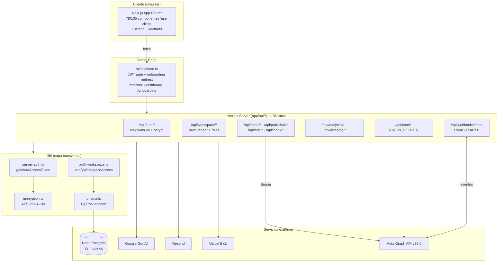

# Auditoría Técnica — Sodare

> Análisis de arquitectura, seguridad, datos, rendimiento, infraestructura y entrega.
> Lentes aplicadas: RepoInsight · VercelOps · SaaS-Core · SecureStack · Data-Core · UX-Core · Growth-Core · AI-Ops · Infra-Core · MetaDev.
> Rama analizada: `feat/onboarding-anti-duplicate-workspaces` · Fecha: 2026-06-08

---

## Resumen Ejecutivo

**Propósito deducido.** Sodare es una plataforma SaaS multi-tenant de *social media management* para agencias: gestiona workspaces/proyectos con roles, publicación programada a Meta (Facebook/Instagram), Ads Manager, inbox unificado (Messenger/IG/comentarios), social listening, briefs, flujos de trabajo con SLA y analítica orgánica/paga, con asistencia de IA (Gemini).

**Stack inferido.**

- **Frontend/Backend:** Next.js 16.2.6 (App Router, RSC) · React 19.2.4 · TypeScript estricto · Tailwind 4 · Zustand · Recharts · Framer Motion.
- **Auth:** NextAuth v4 (JWT) + Prisma adapter; credenciales (bcrypt) + OAuth Google/Facebook.
- **Datos:** Prisma 7 (driver adapter `@prisma/adapter-pg` + `pg.Pool`) sobre PostgreSQL/Neon. 33 modelos, 27 índices.
- **Integraciones:** Meta Graph API (v25.0), Resend (email), Vercel Blob, Google GenAI (Gemini), BotMaker.
- **Entrega:** Vercel (4 crons), GitHub Actions (typecheck + test; lint advisory).
- **Tamaño:** 86 rutas API, 244 archivos TS/TSX, 33 modelos.

**Patrón arquitectónico.** Monolito modular sobre App Router: cada módulo de dominio (publisher, meta, inbox, analytics, streams, listening, workspace) vive como un árbol de rutas en `app/api/*` con UI espejo en `app/dashboard/*`. Lógica transversal centralizada en `lib/` (auth, prisma, encryption, api-response, server-auth). **Buena separación de capas** para el tamaño del proyecto.

**Veredicto.** Código **maduro y con conciencia de seguridad** por encima de la media: cifrado de tokens AES-256-GCM con *fail-fast*, tokens Meta por header `Bearer` (no en query string), verificación HMAC en webhooks, crons protegidos con `CRON_SECRET`, headers de seguridad, `tsconfig` estricto, índices multi-tenant y aislamiento *fetch-then-verify* en rutas dinámicas. Los comentarios `A2 FIX`/`W8 FIX` evidencian rondas previas de hardening.

**No se detectaron credenciales reales expuestas:** `.env*` está correctamente en `.gitignore` (solo `.env.example` con placeholders vacíos se versiona). Los `config_id` de Facebook hardcodeados son identificadores semi-públicos, no secretos.

**Riesgos principales (priorizados):**

1. 🔴 **`prisma db push` en tiempo de build** (`scripts/db-sync.mjs`) — DDL contra prod en cada deploy, sin migraciones versionadas ni revisión; *non-fatal* puede dejar drift silencioso.
2. 🟠 **Validación de entrada ausente** — `zod` es dependencia pero solo se usa en **3 de 86** rutas; la mayoría confía en `await req.json()` sin validar.
3. 🟠 **Sin rate limiting** en `register` / `forgot-password` / `reset-password` / login → fuerza bruta, enumeración de usuarios y *email-bombing*.
4. 🟠 **`typescript.ignoreBuildErrors: true`** en `next.config.ts` — el build de producción ignora errores de tipos pese a `tsconfig` estricto.
5. 🟡 **Sin Content-Security-Policy** (faltante entre headers, por lo demás completos).
6. 🟡 **`xlsx@0.18.5`** con CVEs conocidas (prototype pollution / ReDoS) y entrada de archivos de usuario.
7. 🟡 **Efecto secundario write-on-read** en `getMetaAccessToken` e inconsistencia de autorización de proyectos.

---

## Mapa de Arquitectura



**Flujo de token Meta (núcleo del producto).** `getMetaAccessToken(request, module)` resuelve el token con prioridad: (1) Integration específica del módulo → (2) Integration genérica `meta` del workspace → (3) `accessToken` del JWT del owner. Cifra/descifra con `encryption.ts` y verifica expiración. **Patrón sólido**, con una advertencia (ver Hallazgo #7).

---

## Hallazgos Prioritarios

### 🔴 H1 — DDL en tiempo de build (`db push` contra producción)

- **Ubicación:** `package.json` → `"build": "prisma generate && node scripts/db-sync.mjs && next build"` · `scripts/db-sync.mjs`
- **Problema:** El build de Vercel ejecuta `prisma db push` (sincronización de esquema imperativa) contra la base real, además de hacer `DROP TABLE playing_with_neon`. Es *non-fatal* por diseño: cualquier fallo se loguea y se ignora.
- **Riesgo:** Sin historial de migraciones ni revisión de DDL; un diff destructivo se "surfacea" pero el deploy continúa, dejando **drift silencioso** entre el esquema esperado y el real → errores en runtime difíciles de diagnosticar. DDL acoplado al build mezcla *build* y *release*. Además `ssl: { rejectUnauthorized: false }` en la conexión DDL desactiva validación de certificado (MITM en esa conexión).
- **Evidencia:** comentario en el propio script: *"NON-FATAL by design: any failure here is logged and skipped"*.
- **Remediación:** Migrar a migraciones versionadas y un paso de *release* separado (`prisma migrate deploy`), no `db push`. Quitar el DDL del `build`. Validar TLS también en DDL.

### 🟠 H2 — Validación de entrada ausente (zod en 3/86 rutas)

- **Ubicación:** mayoría de `app/api/**/route.ts` (mutaciones POST/PUT/PATCH).
- **Problema:** El patrón dominante es `const body = await req.json(); const { title, content } = body;` sin validar tipos, longitudes ni campos. `zod` está instalado pero solo aparece en 3 rutas.
- **Riesgo:** *type confusion*, crashes por campos faltantes/no esperados, *mass assignment* al hacer *spread* del body hacia Prisma, y ausencia de límites de tamaño (DoS por payloads grandes). En rutas que importan CSV/Excel (papaparse/xlsx) la entrada no validada agrava H6.
- **Remediación:** Helper de validación + schema por ruta (ver *Refactor Propuesto*).

### 🟠 H3 — Sin rate limiting (fuerza bruta / enumeración / email-bombing)

- **Ubicación:** `app/api/auth/register`, `app/api/auth/forgot-password`, `app/api/auth/reset-password`, login (NextAuth credentials).
- **Problema:** No existe ninguna capa de *throttling* (no hay Upstash/limiter en todo el repo).
- **Riesgo:** Fuerza bruta de contraseñas, enumeración de cuentas vía tiempos/errores de `forgot-password`, y *email-bombing* de víctimas vía reset. Spam de creación de cuentas.
- **Remediación:** Rate limit por IP+email (Upstash Ratelimit o Vercel Firewall) en rutas de auth; respuestas idénticas en `forgot-password` exista o no la cuenta.

### 🟠 H4 — `ignoreBuildErrors: true`

- **Ubicación:** `next.config.ts`.
- **Problema:** El build de producción ignora errores de TypeScript, aunque `tsconfig` es `strict`/`noImplicitAny` y CI corre `tsc --noEmit`.
- **Riesgo:** CI solo dispara en `main` (push/PR a main); ramas de feature pueden desplegarse vía Vercel preview con errores de tipo que el build no detiene. El *type-safety* deja de ser garantía de release.
- **Remediación:** Eliminar el flag una vez saldado el backlog; mientras tanto, exigir el check de `tsc` como *required status* en Vercel/GitHub para todas las ramas.

### 🟡 H5 — Falta Content-Security-Policy

- **Ubicación:** `next.config.ts → headers()`.
- **Problema:** Hay `X-Frame-Options`, `X-Content-Type-Options`, `Referrer-Policy`, `Permissions-Policy`, pero **no CSP**.
- **Riesgo:** Sin la mitigación de mayor valor contra XSS/inyección de scripts, especialmente embebiendo contenido de fbcdn/cdninstagram.
- **Remediación:** Añadir CSP (idealmente con nonce) — ver *Refactor Propuesto*.

### 🟡 H6 — `xlsx@0.18.5` con CVEs conocidas

- **Ubicación:** `package.json` (`xlsx ^0.18.5`), usado junto a `papaparse` para importación.
- **Problema:** 0.18.5 arrastra CVE-2023-30533 (prototype pollution) y CVE-2024-22363 (ReDoS). Las versiones corregidas de SheetJS **no están en npm**, solo en su CDN oficial.
- **Riesgo:** Si se parsean hojas subidas por el usuario, prototype pollution explotable.
- **Remediación:** Migrar a la build oficial de SheetJS (`https://cdn.sheetjs.com`) o a `exceljs`; validar/limitar archivos de entrada.

### 🟡 H7 — Efectos secundarios e inconsistencia de autorización

- **Ubicación:** `lib/server-auth.ts` (`getMetaAccessToken` hace *write-on-read*: persiste el token del JWT en `Integration` durante un GET) · `app/api/projects/[id]/route.ts` redefine `verifyProjectAccess` con semántica distinta a `lib/auth-workspace.ts`.
- **Problema:** (a) Un *getter* con efecto de escritura es impredecible y puede provocar *races* en el `upsert` bajo concurrencia. (b) `lib/auth-workspace.ts → verifyProjectAccess` valida `ProjectMember`, pero la versión inline en la ruta valida `WorkspaceMember` → **dos definiciones de "acceso a proyecto"** que pueden divergir (un miembro del workspace sin membresía de proyecto podría tener acceso por una ruta y no por otra).
- **Riesgo:** Inconsistencia de autorización difícil de auditar; DRY roto.
- **Remediación:** Separar `syncMetaToken()` explícito del *getter* puro; unificar una única función de autorización de proyecto y decidir el modelo (workspace-wide vs project-scoped).

### 🟡 H8 — Cobertura de pruebas mínima

- **Ubicación:** `tests/` (3 archivos: encryption, ads-metrics, meta-errors).
- **Problema:** 3 tests para 86 rutas y 244 archivos. Bien que el cifrado esté testeado; falta todo lo demás (autorización multi-tenant, publisher, webhooks).
- **Remediación:** Tests de integración de autorización (el riesgo más caro) y del flujo de publicación/cron.

---

## Refactor Propuesto

### 1. Helper de validación con zod (resuelve H2)

```typescript
// lib/validate.ts
import { ZodSchema } from "zod";
import { apiError } from "@/lib/api-response";

type Validated<T> =
  | { ok: true; data: T }
  | { ok: false; response: ReturnType<typeof apiError> };

export async function validateBody<T>(
  req: Request,
  schema: ZodSchema<T>
): Promise<Validated<T>> {
  let raw: unknown;
  try {
    raw = await req.json();
  } catch {
    return { ok: false, response: apiError("JSON inválido", "BAD_JSON", 400) };
  }
  const parsed = schema.safeParse(raw);
  if (!parsed.success) {
    const msg = parsed.error.issues.map((i) => `${i.path.join(".")}: ${i.message}`).join("; ");
    return { ok: false, response: apiError(msg, "VALIDATION_ERROR", 422) };
  }
  return { ok: true, data: parsed.data };
}
```

```typescript
// Uso en una ruta — p.ej. app/api/briefs/[id]/route.ts (PATCH)
import { z } from "zod";
import { validateBody } from "@/lib/validate";

const PatchBrief = z.object({
  title: z.string().trim().min(1).max(200).optional(),
  content: z.string().max(50_000).optional(),
  status: z.enum(["draft", "review", "approved", "archived"]).optional(),
  projectId: z.string().cuid().optional(),
});

const result = await validateBody(req, PatchBrief);
if (!result.ok) return result.response;
const { title, content, status, projectId } = result.data; // ya tipado y seguro
```

### 2. Migraciones versionadas en vez de `db push` en build (resuelve H1)

```jsonc
// package.json — separar build de release
{
  "scripts": {
    "build": "prisma generate && next build",          // build: sin tocar la DB
    "db:deploy": "prisma migrate deploy"                // release: migraciones revisadas
  }
}
```

En Vercel, ejecutar `prisma migrate deploy` como paso de *release* (o en un job de CI previo al *promote*), nunca dentro de `next build`. Generar migraciones en desarrollo con `prisma migrate dev` y versionarlas en `prisma/migrations/`.

### 3. Content-Security-Policy con nonce (resuelve H5)

```typescript
// next.config.ts — añadir a headers()
const csp = [
  "default-src 'self'",
  "script-src 'self' 'unsafe-inline'",          // sustituir 'unsafe-inline' por nonce vía middleware
  "style-src 'self' 'unsafe-inline'",
  "img-src 'self' data: https://*.fbcdn.net https://*.cdninstagram.com https://platform-lookaside.fbsbx.com",
  "connect-src 'self' https://graph.facebook.com",
  "frame-ancestors 'none'",
  "base-uri 'self'",
].join("; ");
// { key: "Content-Security-Policy", value: csp }
```

### 4. Rate limit en rutas de auth (resuelve H3)

```typescript
// lib/ratelimit.ts (Upstash)
import { Ratelimit } from "@upstash/ratelimit";
import { Redis } from "@upstash/redis";

export const authLimiter = new Ratelimit({
  redis: Redis.fromEnv(),
  limiter: Ratelimit.slidingWindow(5, "15 m"), // 5 intentos / 15 min
  prefix: "rl:auth",
});

// en app/api/auth/forgot-password/route.ts
const ip = req.headers.get("x-forwarded-for")?.split(",")[0] ?? "unknown";
const { success } = await authLimiter.limit(ip);
if (!success) return apiError("Demasiados intentos, intenta más tarde", "RATE_LIMITED", 429);
// devolver SIEMPRE la misma respuesta exista o no la cuenta (anti-enumeración)
```

---

## Riesgos de Dependencias e Infraestructura

**Dependencias**

- **`xlsx@0.18.5`** — CVEs sin fix en npm (ver H6). *Acción recomendada.*
- **Versiones *bleeding-edge*:** Next 16.2.6, React 19.2.4, Prisma 7.8.0, Tailwind 4. Stack muy nuevo → riesgo de inestabilidad/ecosystem lag (Prisma 7 *types* ya van por detrás, según comentario en `prisma.config.ts`). Fijar versiones y vigilar parches.
- **`next-auth@4.24.14`** sobre Next 16/React 19 — v4 está en mantenimiento; Auth.js v5 es el camino soportado para App Router. Planear migración.
- **Reproducibilidad CI:** `npm install` (no `npm ci`) con nota de que el lockfile "no es portable". El build de CI puede resolver versiones distintas a las fijadas. Recomendado `npm ci` + alinear versión de npm/Node.

**Infraestructura / Entrega**

- **CI solo en `main`** (`on: push/pull_request: branches:[main]`) — ramas de feature sin gate hasta el PR.
- **`pg.Pool({ max: 10 })` por instancia serverless** contra Neon. Con muchas lambdas concurrentes puede presionar conexiones aun usando la URL *pooled*; medir y, si hace falta, bajar `max` o apoyarse en el pooler de Neon.
- **Cliente Prisma generado dentro de `app/generated/prisma`** (gitignored): ubicarlo bajo `app/` puede inflar el grafo de rutas del App Router; preferible fuera de `app/`.
- **`config_id` de Facebook hardcodeados** como *fallback* en `app/api/connect/[module]/route.ts` — no son secretos, pero ata config de prod al código; moverlos solo a env.

---

## Análisis por Lente

| Lente | Estado | Observación principal |
|---|---|---|
| **RepoInsight** | 🟢 Sólido | Arquitectura limpia para el tamaño; capa `lib/` bien definida. |
| **VercelOps** | 🟡 | App Router OK, pero `db push` en build, `ignoreBuildErrors`, 78/105 componentes `use client` (se pierde el beneficio RSC). |
| **SaaS-Core** | 🟢 | Multi-tenancy real (Workspace/Member/roles, invites, planes); aislamiento *fetch-then-verify* correcto en rutas dinámicas. Unificar autorización de proyecto (H7). |
| **SecureStack** | 🟢/🟡 | Cifrado, HMAC, Bearer, headers, cron secret = muy bien. Faltan: CSP, rate limiting, validación de entrada. |
| **Data-Core** | 🟡 | 27 índices, casi todos workspace-scoped (bien). Migrar de `db push` a migraciones; revisar pooling. |
| **UX-Core** | 🟡 | Componentes-Dios (AnalyticsDashboard 2,001 líneas; InboxLayout 1,986; proyectos/[id] 1,766) → descomponer; alta densidad cliente afecta bundle. |
| **Growth-Core** | 🟢 | Suite analítica rica (best-time, growth, organic, audience, reels, stories) + `BestTimeCache`/`HashtagCache`. Base de datos para *insights* bien modelada. |
| **AI-Ops** | 🟡 | Gemini en `gridia` y `briefing`. **Verificar** que `GEMINI_API_KEY` nunca llegue al cliente (`gridia/token` parece emitir credencial efímera — confirmar *scoping*/expiración) y añadir guardas anti prompt-injection. |
| **Infra-Core** | 🟡 | 4 crons coherentes; separar *build* de *release*; validar TLS en DDL; `npm ci`. |
| **MetaDev** | 🟢 | Manejo de Graph API ejemplar: versión centralizada (`META_API_VERSION`), Bearer no-query, paginación que limpia `access_token`, webhook HMAC, `data-deletion`/`deauthorize` presentes. |

---

## Siguientes Pasos (plan priorizado)

**Sprint 1 — Seguridad y entrega (alto impacto, bajo esfuerzo)**

1. Sustituir `db push` en build por `prisma migrate deploy` como paso de release (H1).
2. Añadir rate limiting a rutas de auth + respuesta anti-enumeración en `forgot-password` (H3).
3. Añadir Content-Security-Policy a `headers()` (H5).
4. Actualizar/`reemplazar `xlsx@0.18.5` y validar archivos importados (H6).

**Sprint 2 — Robustez**

5. Introducir `lib/validate.ts` + schemas zod, empezando por todas las mutaciones (H2).
6. Quitar `ignoreBuildErrors` tras saldar el backlog de tipos; hacer `tsc` *required* en todas las ramas (H4).
7. Unificar autorización de proyecto y eliminar el *write-on-read* de tokens (H7).

**Sprint 3 — Mantenibilidad**

8. Descomponer los componentes-Dios (>1,500 líneas) y mover lógica de datos a Server Components donde aplique.
9. Tests de integración de autorización multi-tenant y del flujo publisher/cron (H8).
10. `npm ci` + alinear Node/npm en CI; planear migración a Auth.js v5.

---

*Hallazgos basados en evidencia directa del repositorio (rutas, `lib/`, esquema Prisma, configs y CI). Donde se indica "verificar", la conclusión depende de archivos no inspeccionados en detalle (p. ej. `gridia/token` y `geminiClient.ts`).*
